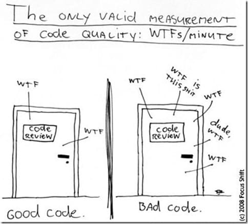

## Code Reviews

> Code Review, or Peer Code Review, is the act of consciously and systematically
> convening with one's fellow programmers to check each other's code for
> mistakes, and has been repeatedly shown to accelerate and streamline the
> process of software development like few other practices can.

Usual benefits of code review: improved quality, sharing knowledge across the
team, adherence to coding conventions, reduced project development time, minimizing code
defects, consistent documentation and comments, better testing.

A code review involves one or more developers examining source code they didn't
write and providing feedback to the authors, both negative and positive.
Ideally the reviewers are completely disengaged from the project they are
reviewing as this maximizes objectivity and ensures the code is readable and
maintainable even by those not already well-versed in that project. Typically
the reviewers will have a standard checklist as a guide for finding common
mistakes and to validate the code against the company's coding standards.



_Code should be not just working, but also clear_

The main concerns during a review are maintainability, scalability and efficiency.
Also code reviewers should look for common bugs, especially those that are
notoriously difficult to find after-the-fact. These include proper thread
synchronization, handling error conditions correctly and completely, correct
accounting for reference-counting and other potential resource leaks, violating
array or buffer boundaries (including off-by-one error), broken boolean
expressions.

Though everyone can do a code review, only members of 'developers' team are
obliged to do so. Take this seriously, doing a review is a task on its own.
Inspection rate should be under 500 lines of code per hour. Do not review for
more than an one hour at a time, take a break. But don't expect to make it in less
than 10 minutes, since shallow reviews are futile. Fill checklist **and** write some
text, describing your opinion about the changes. Follow the bugs/issues found and
their fixing. Peer review can put strain on interpersonal team relationships,
so be careful and neutral.

Here is a long list of items a good reviwer should consider during the
review. Not all items might be applicable to every Pull Request, but there should
be a conscious desicion to omit an item.

- the problem involved is clear, description is sufficient
- proposed solution seems reasonable (it solves the problem and doesn't break things)
- the solution is optimal (this is a much harder question than previous one)
- [code style](CodeStyle.md) is complied
- no useless changes are introduced (extra spaces, empty lines, etc…) 
- documentation is updated (if necessary)
- watch for common bugs (OBOE, nullptr, leaks, many more…)
- code compiles (not just the new code, but the entire project as well)
- no warnings appear (during both compilation and run)
- performance isn't degraded (estimation is enough, measurement isn't required)
- various tests pass (build, automated, nightly… various)

The checklist for a reviewer (copy this to your review and fill it):

```
- [ ] the problem is clear
- [ ] the modification addresses the problem
- [ ] code style is complied
- [ ] documentation is properly updated
- [ ] the code compiles
- [ ] standard tests pass
```

There are nice [tools](https://en.wikipedia.org/wiki/List_of_tools_for_code_review)
that helps conducting a code review.

You can read more about code reviews
[here](https://smartbear.com/learn/code-review/best-practices-for-peer-code-review/) and
[here](http://www.ganssle.com/inspections.pdf).
