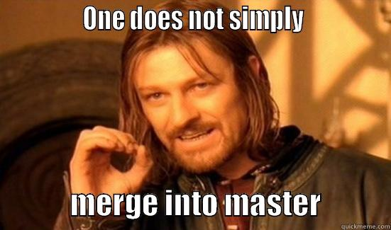

# Using Git

## Table of contents<a name="toc"></a>

1. [Introduction](#introduction)
2. [Repositories and commits](#reps_commits)
   1. [Repositories](#repositories)
   2. [Branches](#branches)
   3. [Making changes](#making_changes)
   4. [Commits](#commits)
   5. [Remote branches](#remote_branches)
   6. [Merge and rebase](#merge_rebase)
   7. [Extra topics](#extra_topics)
3. [GitHub workflow](#githubflow)
   1. [Feature branch workflow](#branchflow)
   2. [Pull Request](#pull_request)
   3. [Code Review](#code_review)
   4. [Testing](#testing)
   5. [Merge to master and releases](#merges_releases)
4. [Summary](#summary)

## Introduction<a name="introduction"></a>

The source code for the project resides in a Git repository hosted on GitHub.

General introduction to Revision Control and Git is [here](GitIntroduction.md).

A bunch of arguments in favor of Git is [here](https://www.atlassian.com/git/tutorials/why-git).

## Repositories and commits<a name="reps_commits"></a>

Terminology ([extended](https://en.wikipedia.org/wiki/Version_control#Common_terminology)):

+ **Repository** is where files' current and historical data are stored,
contains all files and revisions, can be local or remote
+ **Working tree** is a full tree of directories and source files you're working
with, the local copy of files from a repository, at the specific revision
+ **Index** is a staging area that lists a specific state of working tree,
usually before commit
+ **Branch** is a set of files that cover a separate line of commits, allows
development at different speeds or in different ways independently of each other
+ **Master** (aka trunk, baseline, mainline) is a branch that holds the main
line of code development
+ **Commit** is a separate revision of source files, also the process of
_committing_ changes in source, that form such revision
+ **HEAD** (aka tip) is the most recent commit in the current branch
+ **Tag** is an important snapshot in time, consistent across many files,
that forms a _tagged version_
+ **Patch** (aka diff) is a text file that consists of a list of differences
between revisions, existing commit can be exported as patch, also see `man diff`
and `man patch`

Since working with nEXO-offline implies building and executing the code, we will
concentrate on operations using the command-line. Nevertheless, it should be noted,
that many things can be done using the GitHub web interface, even changing files
and making new commits are possible.

### Repositories<a name="repositories"></a>

Even though every Git repository contains full information, there is one
distinguished, which is called main. It is located on GitHub and works as a
place where developers can exchange and merge their code to produce a single
product. This is also a place to discuss plans, propose changes and
discover issues.

One needs to have a GitHub account to work on GitHub. Creating new account is
free and it is sufficient to work with nEXO, but you need to be included into a
[nEXO-collaboration](https://github.com/nEXO-collaboration) organization. Send
an e-mail to [Jason Brodsky](mailto:brodsky3@llnl.gov) or
[Heather Kelly](mailto:heather@slac.stanford.edu) if you want to join. Also there are
several [teams](https://github.com/orgs/nEXO-collaboration/teams) organized to
work on particular topics.

Two main repositories you will be working with are:
[nEXO-offline](https://github.com/nEXO-collaboration/nexo-offline) software and
area for [user projects](https://github.com/nEXO-collaboration/user_projects).

To work with files in a repository, one needs to create a local copy of remote
repository. This process is called _cloning_ and it is done with the command

```
$ git clone https://<user_name>@github.com/nEXO-collaboration/nexo-offline.git
```

This will create a local copy of remote 'main' repository, which will be added
with the name 'origin' (see output of `git remote -v`).

For a better experience, don't forget to set your user name and e-mail address
in repository configuration, because this information will be used later, every
time when you will commit your changes.

```
$ git config user.name "John Doe"
$ git config user.email johndoe@example.com
```

More information how to start can be found
[here](https://git-scm.com/book/en/v2/Getting-Started-First-Time-Git-Setup) and
[here](https://www.atlassian.com/git/tutorials/setting-up-a-repository).

### Branches<a name="branches"></a>

By default after cloning, the working tree contains the tip of the 'master' branch. Now
you need to decide what revision you will use to start your work. All code development should
be performed on a branch, and not on 'master'.

To list branches in the repository use `git branch` command. The current branch will
be marked with '*' sign. If you want to switch to another branch and populate
working tree with files from it use `git checkout <branch>`. Usually you will
create a new branch to introduce changes:

```
$ git checkout -b <new_branch> <starting_point>
```

This command will create a new branch, pointing to a specified revision, and
this branch will be checked out. See `man git-checkout` for more details.

That creates local branches, which exist on your local host only. See
`man git-branch` for other operations on branches. For remote branches, which
are visible to other people see below.

You can read more about working with branches
[here](https://git-scm.com/book/en/v2/Git-Branching-Branches-in-a-Nutshell) and
[here](https://www.atlassian.com/git/tutorials/using-branches).

### Making changes<a name="making_changes"></a>

Each file in working tree can be in _tracked_, when Git know about it, or
_untracked_ state, when Git doesn't care. Right after checkout all tracked files
are in _unmodified_ state. If you make some changes to its content, it will become
_modified_, because it is different from the state recorded in current revision.
If you like your changes, you can mark it _staged_ to indicate, that you want
that included in next commit. Performing a commit will set changed file back to
unmodified state, because new commit will contain new state.


_The life cycle of the status of your files_

The main command in this process is `git status`. It will show you all
differences between working tree and current revision:

```
# On branch master
# Your branch is up-to-date with 'origin/master'.
# Changes to be committed:
#   (use "git reset HEAD <file>..." to unstage)
#
#       new file:   Doc/UsingGit.md
#       modified:   Doc/README.md
#
# Changes not staged for commit:
#   (use "git add <file>..." to update what will be committed)
#   (use "git checkout -- <file>..." to discard changes in working directory)
#
#       modified:   Doc/CodeStyle.md
#
# Untracked files:
#   (use "git add <file>..." to include in what will be committed)
#
#       using_git.patch
```

This is a very detailed description, with suggestions on commands to use for a
certain action. Also you can try `git status -s` to display short version.

Important commands here are `git add <file>`, `git checkout -- <file>`,
`git rm <file>`, `git mv <file>`, `git diff [--staged]`. The first four actually
manipulate files, and the last one shows you the exact lines added and removed —
the patch, as it were.

You can read more about working with files and process of commit preparation
[here](https://git-scm.com/book/en/v2/Git-Basics-Recording-Changes-to-the-Repository) and
[here](https://www.atlassian.com/git/tutorials/saving-changes).

### Commits<a name="commits"></a>

When you are finished editing files, it's time to create a commit, that contains
your changes. Now double check what is in your staging area. Remember that
anything that is still unstaged — any files you have created or modified that
you haven’t run `git add` on since you edited them — won’t go into this commit.
Use `git diff` to check if any unwanted changes leaked into staging area. It is
important to keep history clean of parasitic changes, like extra spaces or empty
lines, because this disturbs `git blame` results with noise and complicate
understanding of file history.

Commit makes an atomic change, for the sake of clarity and good history, one
commit should be devoted to one task only. If during long development of a new
feature you suddenly find and fix a bug, it would be wise to split this fix into
a separate commit. This will simplify code review and bug hunting in case of
problems.

We support responsible collaboration, so, ideally, no revisions should be broken
in any sense. On the other hand, we aren't ready to enforce
[test-driven development](https://en.wikipedia.org/wiki/Test-driven_development).
And you can't run full simulation and processing for every commit. Yet, one thing
that everyone can do is to verify that code can be build. The majority of
problems will trigger a compiler error or warning. So developers are encouraged to 
compile the entire project with your changes. Remember, you are responsible for keeping
it working.

The simplest way to commit is to use `git commit`. Doing so launches your editor
of choice (use `git config --global core.editor` to change) with default commit
message:

```

# Please enter the commit message for your changes. Lines starting
# with '#' will be ignored, and an empty message aborts the commit.
# On branch master
# Your branch is up-to-date with 'origin/master'.
#
# Changes to be committed:
#       new file:   Doc/UsingGit.md
#       modified:   Doc/README.md
#
```

Or you can use `git commit -m "commit message"` with message inline, if you don't
want to start an editor.

Important topic here is the actual commit message. A well-crafted Git commit message is the
best way to communicate _context_ about a change to fellow developers (and indeed
to their future selves). A diff will tell you _what_ changed, but only the commit
message can properly tell you _why_. The Linux kernel and Git itself are great
examples of good commit messages.

<a name="commit_message"></a>
**The seven rules of a great Git commit message:**

1. Separate subject from body with a blank line
2. Limit the subject line to 50 characters
3. Capitalize the subject line
4. Do not end the subject line with a period
5. Use the imperative mood in the subject line
6. Wrap the body at 72 characters
7. Use the body to explain _what_ and _why_ vs. _how_

For example:

```
Summarize changes in around 50 characters or less

More detailed explanatory text, if necessary. Wrap it to about 72
characters or so. In some contexts, the first line is treated as the
subject of the commit and the rest of the text as the body. The
blank line separating the summary from the body is critical (unless
you omit the body entirely); various tools like `log`, `shortlog`
and `rebase` can get confused if you run the two together.

Resolves: #123
See also: #456, #789
```

It is reasonable to begin commit subject with standard words: fix, add, update,
rework, change. For more details see a [good manual](https://chris.beams.io/posts/git-commit/).

If, after doing a commit, you noticed an error, you can introduce changes to
the latest commit using `git commit --amend` command. But be careful, this only
works in your local repository, i.e. before `git push`.


_How Git commands change state of objects_

### Remote branches<a name="remote_branches"></a>

If you need to show your work to other people, it should be uploaded to the main
repository. For this you need to have a branch in there. The simplest way to do
so, is it use web interface. Everything is done using 'Branch: ...' button in
repository view. First you switch to a desired starting point, then you create a
new branch. After `git fetch` command, this branch will appear in the list of
branches of remote repository. Then you need to create a local branch that is
connected to this remote branch:

```
$ git checkout --track origin/<branch>
```

In the main repository the list of branches is shared among all users, so it is
important to use sensible names for branches. Choose names carefully: within 20
characters, no spaces, descriptive. If this branch is directly related to a GitHub
issue, name it after the issue number i.e. issue_1.    

If several people are working on the same branch, it is advised to do a `git pull`
command before doing new commits. This will load recent changes on branch from
the remote repository and merge it into connected branch in local repository.

When you have completed your changes and created commits and double checked that everything
is fine, it is time send your changes to the remote repository. This is done
with the command:

```
$ git push origin <branch>
```

Usually this goes fine, but on rare occasions, when someone else already pushed
his changes to the same branch after your pull, your push will be rejected. This
happens because by Git can't merge two independent changes together and you need
to resolve it. Don't consider `git push --force`, because it will destroy
changes of the other person. For you in this case the right thing to do will be
to make a rebase or a merge (less desired) of your commits. See next section for
how to do it.


_Don't do a `git push --force` in a public repository_

Sometimes you'll find that you're totally screwed up commit line in some way,
then a strong wish to fix it may appear. It is completely fine to rewrite commit
history while it is local. But if you already did a `git push` it is no way.
So check twice before sending your commits to a public repository. Yet, you can
always create a new branch with reworked commits.

You can read more about distributed work
[here](https://git-scm.com/book/en/v2/Git-Branching-Remote-Branches) and 
[here](https://www.atlassian.com/git/tutorials/syncing/git-push).

### Merge and rebase<a name="merge_rebase"></a>

NB: Merging to master using GitHub is covered below in section ["Pull request"](#pull_request).

NB: Merge can be complicated, in case of problems, don't hesitate to ask
professionals for help.

Multiple branches are useful during development, but finally you want all
changes collected in one place. A _merge_ is a process when you take the
independent lines of commits and integrate them into a single branch with
unified history. In most cases merge can be reduced to a combination of two
branches.

The simplest case is when there is a linear path of commits from the current
branch tip to the target branch. This is so called _fast forward merge_.
In this case Git simply moves the branch tip to a new commit and that make it.
The following commands will do that:

```
$ git checkout my_work
Switched to branch 'my_work'
$ git merge --ff-only hotfix
Fast-forward
README.md |    1 +
1 file changed, 1 insertion(+)
```

Another case is when both branches already have own commits, but changes has
no relation at all, like separate bug fixes. In this case normal fast-forward
isn't possible, but one can 'move' commits from one branch to the top of the
other branch. Since changes are independent, it goes smoothly and usually
don't need any extra changes. And than fast-forward is possible again.
This is what _rebase_ does. The following commands will do that:

```
$ git checkout hotfix
Switched to branch 'hotfix'
$ git rebase my_work
First, rewinding head to replay your work on top of it...
Applying: Update README.md with new links
```

Now 'hotfix' branch is ready for fast-forward merge described above.

NB: Rebasing in public repository is dangerous for any downstream branch.
So it is advised to use rebase on a 'finished' branches only, right before
merge & close.

Sometimes it turns out, that there were many commits but result made actually
one change. This is possible if approach to a problem had changed or you had
to split naturally one change into several commits (e.g. to show it). In this
case keeping rejected ways in history is futile. Here you can use a _squash_
merge, which will join all commits from branch into one commit and put it on
top of current branch:

```
$ git checkout my_work
Switched to branch 'my_work'
$ git merge --squash hotfix
Squash commit -- not updating HEAD
Automatic merge went well; stopped before committing as requested
$ git commit -a
```

In a generic case, you need to do a true merge. Usually Git does this by a
simple three-way merge, using the two snapshots pointed to by the branch tips
and the common ancestor of the two. Here Git creates a new snapshot that results
from this three-way merge and automatically creates a new commit that points to
it. This is referred to as a _merge commit_, and it is special in that it has
more than one parent.


```
$ git checkout my_work
Switched to branch 'my_work'
$ git merge hotfix
Merge made by the 'recursive' strategy.
README.md |    1 +
1 file changed, 1 insertion(+)
```


_Git graphs for merge and rebase_

<a name="merge_conflict"></a>
Occasionally, merge process doesn’t go smoothly. If the same part of the same
file was changed differently in the two branches you’re merging, Git won’t be
able to merge them cleanly and you’ll get a merge conflict that looks
something like this:

```
$ git merge hotfix
Auto-merging README.md
CONFLICT (content): Merge conflict in README.md
Automatic merge failed; fix conflicts and then commit the result.
```

Git hasn't automatically created a new merge commit. It has paused the process
while you resolve the conflict. You can more details about current state using
`git status`. Anything that has merge conflicts and hasn't been resolved is
listed as unmerged. Git adds standard conflict-resolution markers to the files
that have conflicts, so you can open them manually and resolve those conflicts.
Your file contains a section that looks something like this:

```
<<<<<<< HEAD:README.md
<div id="footer">contact : email.support@github.com</div>
=======
<div id="footer">
 please contact us at support@github.com
</div>
>>>>>>> hotfix:README.md
```

The area where a pair of conflicting changes happened is defined with markers
'<<<<<<<', '=======', and '>>>>>>>'. The part before the '=======' is typically
your side, and the part afterwards is typically their side. In order to resolve
the conflict, you have to either choose one side or the other or merge the
contents yourself. After you've resolved each of these sections in each
conflicted file, run `git add` on each file to mark it as resolved. Staging
the file marks it as resolved in Git. At the end you'll be ready to do a
`git commit`.

While you can use either of these merge strategies, many developers like to use
fast-forward merges (facilitated through rebasing) for small features or bug
fixes, while reserving 3-way merges for the integration of longer-running
features. In the latter case, the resulting merge commit serves as a symbolic
joining of the two branches.

NB: We don't want several copies of the same commits in history, double check
your merge result locally, before pushing it to the main repository.

You can read more about merge and conflicts
[here](https://git-scm.com/book/en/v2/Git-Branching-Basic-Branching-and-Merging) and
[here](https://www.atlassian.com/git/tutorials/using-branches/git-merge).

### Extra topics<a name="extra_topics"></a>

The following things are also very useful, but not covered here:

1. `git reset` manipulates files, index and HEAD
2. `git stash` stashes the changes in a dirty working directory away
3. `git format-patch` and `git am` exports commits as patches for e-mail submission or applies it back
4. `git merge -s` allows to choose from several merge strategies and simplify process
5. `git rebase -i` allows to modify history in many ways, [see](https://git-scm.com/book/en/v2/Git-Tools-Rewriting-History)
6. `git bisect` is useful during finding the change that introduced a bug
7. Atlassian's [tutorials](https://www.atlassian.com/git/tutorials/advanced-overview)
8. ['Git tools'](https://git-scm.com/book/en/v2/Git-Tools-Revision-Selection) from 'Pro Git' book

## GitHub workflow<a name="githubflow"></a>

On the way to make a great experiment, our aim is to create great analysis
software, keep stable code base, have less mistakes and provide high overall
quality. To fulfil this task, every change introduced to the source code should
be reasonable, conscientious, considered and should improve the code. We plan
to achieve this by using branching workflow and code review. Every piece of
code should be discussed before merging to master branch.



_Only Pull Request after Code Review can be merged into master_

GitHub naturally supports wild branching and offers a perfect tool to run a
discussion of changes. It is called Pull Request and it is tightly integrated
with the underlying Git repository, anyone can see exactly what changes would
be merged.

Here is a generic sequence:

1. create a feature branch from 'master'
2. make some commits to implement the feature and push your branch to the main repository
3. open a Pull Request on GitHub
4. discuss and optionally continue committing during Code Review
5. do final testing with real task
6. someone from developer team merges or closes the Pull Request


### Feature branch workflow<a name="branchflow"></a>

The core idea behind the Feature Branch Workflow is that a development of a
feature should take place in a dedicated branch instead of the master branch.
This encapsulation makes it easy for multiple developers to work on a
particular feature without disturbing the main codebase. It also means the
master branch will never contain broken code, which is a huge advantage for
continuous integration environments. And it also simplifies parallel work
on independent features.

When you create a branch in your project, you're creating an environment where
you can try out new ideas. Changes you make on a branch don't affect the
'master' branch, so you're free to experiment and commit changes, safe in the
knowledge that your branch won't be merged until it's ready to be reviewed by
someone you're collaborating with. Branching is a core concept in Git, and the
entire GitHub flow is based upon it. There's only one rule: anything in the
'master' branch is always deployable.

Encapsulating feature development also makes it possible to leverage pull
requests, which are a way to initiate discussions around a branch. They give
other developers the opportunity to sign off on a feature before it gets
integrated into the official project. Or, if you get stuck in the middle of a
feature, you can open a pull request asking for suggestions from your
colleagues. The point is, pull requests make it incredibly easy for your team
to comment on each other's work.

You can read more about feature branch workflow
[here](https://git-scm.com/book/en/v2/Git-Branching-Branching-Workflows#_topic_branch) and
[here](https://www.atlassian.com/git/tutorials/comparing-workflows/feature-branch-workflow).

Managing branches on GitHub is [very easy](https://help.github.com/en/articles/creating-and-deleting-branches-within-your-repository).

### Pull Request<a name="pull_request"></a>

You can open a Pull Request at any point during the development process: when
you have little or no code but want to share some screenshots or general ideas,
when you're stuck and need help or advice, or when you're ready for someone to
review your work.

Code review is a major benefit of pull requests, but they’re actually designed
to be a generic way to talk about code. You can think of pull requests as a
discussion dedicated to a particular branch. This means that they can also be
used much earlier in the development process. For example, if a developer needs
help with a particular feature, all they have to do is file a pull request.
Interested parties will be notified automatically, and they’ll be able to see
the question right next to the relevant commits.

You can [create a Pull Request](https://help.github.com/en/articles/creating-a-pull-request)
using GutHub web interface. Go to repository and switch to your feature branch.
Use the button 'New pull request' or, if you just pushed, there will be a green
button 'Compare & Pull Request'. Both create a new Pull Request.
Now you'll need to give a title and
description for your Pull Request. It is almost always worthwhile to put some
effort into this, since a good description helps to determine, what you were
trying to do, whether your proposed changes are correct, and whether accepting
the changes would improve the project. Your annotation should guide the
reviewer through the changes, showing which files to look at first and
defending the reason behind each code modification. As an added benefit, you
will often find additional errors before the peer review even begins. Also
attached is a list of the commits in our topic branch that are _ahead_ of the
master branch and a unified diff of all the changes. Don't forget to hit the
'Create pull request' button on the page to actually create one.

All Pull Requests and attached discussions are available from repository's page.
Anyone can can participate in discussion, both commenting on a line of code and
leaving a general comments. You can see that the code comments are brought into
the conversation as well. Now you can see what you need to do in order to get
your change accepted. With GitHub you simply commit to the feature branch again
and push, which will automatically update the Pull Request.

Commit messages are important, especially since Git tracks your changes and
then displays them in Pull Request once they're pushed to the server. By writing
clear commit messages, you can make it easier for other people to follow along
and provide feedback.

NB: Adding new commits to your branch doesn't trigger notifications. You need
to write a new comment to send one. Also only subscribed persons receive such
notifications. If you want to attract someone else's attention, use GitHub's
@\<name> notification in comment.

You can read more about pull requests
[here](https://git-scm.com/book/en/v2/GitHub-Contributing-to-a-Project#_creating_a_pull_request) and
[here](https://www.atlassian.com/git/tutorials/making-a-pull-request) and
[advanced](https://git-scm.com/book/en/v2/GitHub-Contributing-to-a-Project#_advanced_pull_requests).

### Code Review<a name="code_review"></a>

Code Review is an important part of the development process, it helps to create
a better software and to share knowledge across our team. Every Pull Request
should pass a Code Review before merging to master branch. GitHub is a perfect
platform to do it, because it has everything integrated. Just use the web
interface.

Instructions for reviewer are [here](DoingCodeReview.md).

It may happen, that some issues in code provided will be found, or a better
approach will be offered. It is author's of Pull Request duty to follow these
things and implement required changes.

### Testing<a name="testing"></a>

Not yet implemented. Potential items:

- style (astyle, clang-format)
- unit tests (lcov, coverage.py)
- static analysis (cppcheck, scan-build, PyLint)
- automatic build (Jenkins, buildbot)
- integration testing (run full simulation)

### Merge to master and releases<a name="merges_releases"></a>

Do merge Pull Requests only after code review and testing. Remember that there
are 3 native modes of merge available on GitHub: 'merge', 'rebase' and 'squash'.
Choose one which suits better, or do it manually.

NB: If you would prefer, you can simply pull the feature branch down and merge
it locally. If you merge this branch into the 'master' branch and push it to
GitHub, the associated Pull Request will automatically be closed. If you
changed history, you need to put 'Closes #\<PR>' in some commit.

A new version is released to indicate that significant improvement is achieved.
It is tagged in Git with label in the form 'v\<major>.\<minor>'. Patch versions
can be published in case of important bugs fixed.

## Summary<a name="summary"></a>

- have github account
- develop in a separate branch
- see [tutorials](https://www.atlassian.com/git/tutorials)
- create issues and Pull Requests
- participate in discussion of your Pull Request
- even if review was positive, leave couple of days for additional opinions before doing actual merge
- think twice before merging to master
