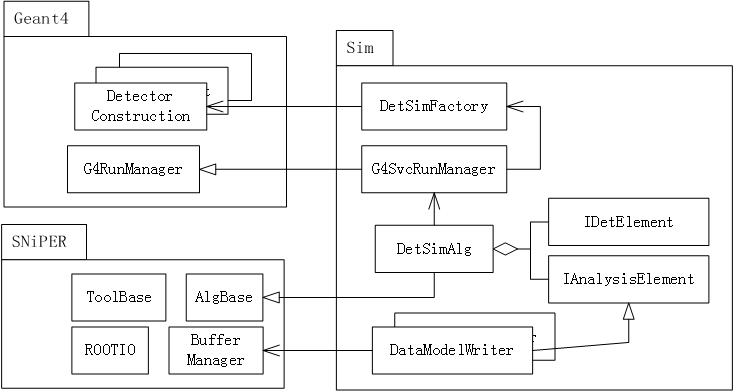

# Detector Simulation
## Detector Simulation Framework
To integrate `SNiPER` and `Geant4`, a common detector simulation framework is designed.

## Changes between standalone simulation and simulation framework
For nEXO detector simulation, a service called `nEXOSimFactorySvc` is used to specify detector construction, physics lists and physics generators.

Most of the simulation code is unchanged except `nEXOAnalysis`. The main change of `nEXOAnalysis` is the creation of event data model. The `SimEvent` object is put into the buffer and then saved into ROOT file using `ROOTOutputSvc`.

Another change is main program. Now a python script is used to control the simulation. The benefit from framework is the unified job running. In python, [`argparse`](https://docs.python.org/2/library/argparse.html) could be used as a command line parser.

After using framework, it is easy to connect different data processing units. For an example, the output of detector simulation can be the input of electronics simulation while they could be in the same job. The geometry service could be used to share the geometry between different algorithms.

## analysis algorithm
To show the user how to access event data and save their own data, [an example](../Simulation/DetSim/nEXOSimAna/) is created.
