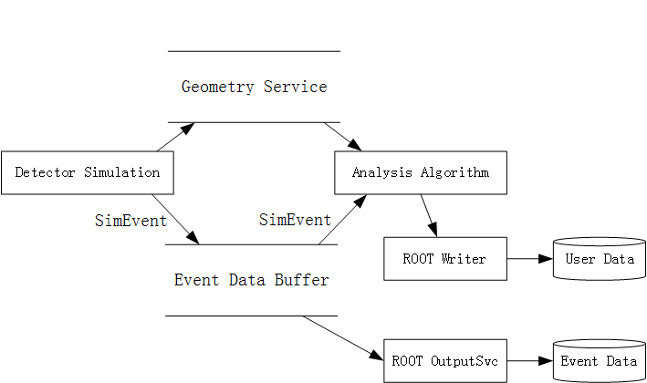

# Quick Start
Assume the software is already installed under your directory:
```
/home/nexo/nexo-dev/nexo-june11
```

## setup environment
Source the setup script under `NEXOTOP`.
```
source $NEXOTOP/setup.sh
```

## run detector simulation and related analysis algorithm
### compile the analysis package
```
cd $NEXOTOP/nexo-offline/Simulation/DetSim/nEXOSimAna/cmt/
cmt br cmt config
source setup.sh
cmt br cmt make
```
[`CMT`](http://www.cmtsite.net/) is an old configuration management tool. It helps us:

1. Compile the code (**Makefile**).
2. Setup runtime environment (**setup.sh**).

When building a package, CMT will check the dependencies and build them automatically when `cmt br` is used.
`cmt config` will generate Makefile and setup script. `cmt make` will build the software.

A CMT package consists several directories and files:
* `cmt`
  * `requirements`, describe how to build the package.
  * `version.cmt`, describe the version.
* `src`, source code

### run the test script
```
cd $NEXOSIMANAROOT/share
python run.py --run run_gamma_noop.in 
```
Note, `$NEXOSIMANAROOT` is created by CMT after you `source setup.sh`.

### about the example


The script `run.py` runs two algorithms, one is to do detector simulation and another is to do analysis. The detector simulation outputs event data. The analysis algorithm outputs user defined data.

The event data buffer is used to hold event data and can be accessed from algorithms at different phase. In this script, detector simulation generates a `SimEvent` object and puts it into the buffer. Then the analysis script accesses the buffer and loads the data.

There are two output related services. `RootOutputSvc` will output the event data model. For the normal users, they often use `RootWriter` to output user defined data, such as histograms, trees and so on.

For the non-event data, such as detector geometry, are often managed by services. In the example, we access the geometry using `SimGeomSvc`.
