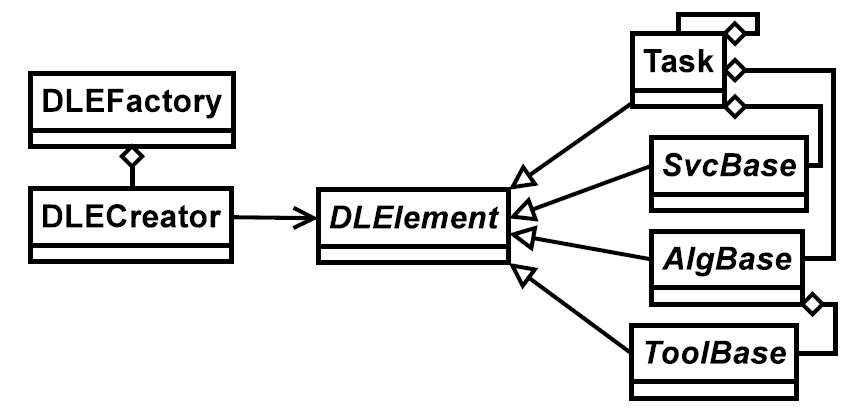

# SNiPER 
[SNiPER](http://inspirehep.net/record/1414106) (**S**oftware for **N**on-coll**i**der **P**hysics **E**xpe**R**iments) is a data processing framework for non-collider physics.

## components design


* `Algorithm` is a unit in data processing chain.
* `Service` is often used by many algorithms.
* `Tool` is lightweight object to help data processing.
* `Task` is a lightweight application manager.

## dynamically loaded
To make each component can be created and loaded dynamically, a factory is used. The technique is when a library is loaded, the global objects will be created. So when an algorithm or a service is created, an extra macro is used to help developers create global objects.

components | macro
---------- | -----
`Algorithm` | `DECLARE_ALGORITHM`
`Service` | `DECLARE_SERVICE`
`Tool` | `DECLARE_TOOL`

## property 
A property is often declared in C++, while set the value in Python. It is convenient for the developers to use properties. The classes derived from `DLElement` support such feature.

In C++ code:
```c++
RandomSvc::RandomSvc(const std::string& name)
    : SvcBase(name)
{
    declProp("Seed", m_init_seed);
}
```

In Python code:
```python
import RandomSvc
rndm = task.createSvc("RandomSvc")
rndm.property("Seed").set(42)
```
